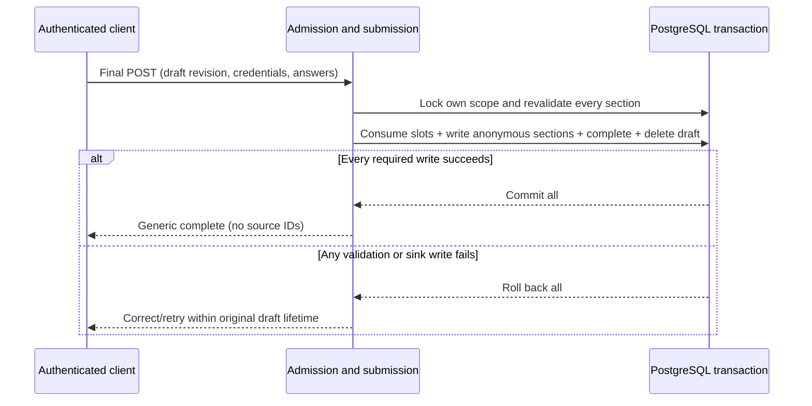

# Anonymous submission protocol

Version 1.0, 2026-09-07. Design for #13; no credential or cryptographic
implementation is delivered by this document. Mandatory authorities are the
[anonymity policy](anonymity-policy.md), [check-in policy](check-in-policy.md),
[architecture](architecture.md), [analysis contracts](analysis-contracts.md) and
[implemented window contract](../signal_loop/windows/README.md). The
[plan](plan.md) fixes the remaining implementation owners.

This protocol separates identity-side eligibility and completion from stored
project feedback. It does not promise anonymity against infrastructure compromise,
collusion, identifying text or arbitrary prior knowledge. Production collection
and release remain disabled until the clearance table below is satisfied. A
passing synthetic fixture is not evidence that real people have been deduplicated.

## 1. Scope and distinct-person prerequisite

Admission scope is `(organisation, local Monday week, project)`, resolved against
an immutable #12 window, never client-supplied dates alone. The organisation IANA
timezone determines local Monday midnight through next local Monday midnight;
UTC comparisons implement `[opens_at, closes_at)`. The local week date, not its
UTC opening date, is the artifact week. Eligibility is the original snapshot
intersected with current activity; joins wait for the next captured window,
revocations deny immediately, and historical roles never grant live authority.

Define an **admission principal** as one verified natural person across the
participating organisations. Accounts are login aliases of that principal, not contributors in
their own right. Identity-side provisioning must attest both that aliases for one
person share the principal and that different principals represent different
people. A unique account ID, email address, membership ID, or hash of any of them
does not establish this. Account creation alone must never create a verified
principal. Automated unverified resolution returns unavailable, not a fallback
principal. Identity/principal records cannot be read by feedback or analysis.

The #14 interface `resolve_verified_principal(authenticated_user, organisation)`
returns a verified identity-side principal or refuses admission. #14 must supply
an explicit provider boundary, unique principal/scope constraints, alias-account
deduplication tests, and fail-closed behavior for missing/unverified attestations.
Local tests inject a synthetic directory: Rowan's two accounts map to P1, Avery
maps to P2, an unverified account maps to nothing. This is sufficient to test the
protocol's mechanics, not real-world verification. #42 owns actual provisioning
and evidence review; #14 cannot substitute an account-ID implementation and leave
that correctness gap to operations. The production provider and its operating
procedure are unresolved release prerequisites (R1).

For each verified principal/project/window, one unique participation row can
transition from unused to consumed once. Each such transition admits exactly one
substantive feedback section in the same transaction. Thus, conditional on the
verified directory and the transaction proof, each accepted section has one
distinct natural person in that project-week. Independent random feedback IDs
can then identify sources *within that project-week* for support deduplication.
They are not principal IDs. Multiple answers/support references from that one
section count once. Aliases, retries, blanks and extra questions cannot inflate
the count. P1/P2 still require five actual contributors/supporters and every
content/inference gate; a roster and a provider's guessed count are insufficient.

## 2. Data inventory and boundaries

The following are permitted field sets, not permission to copy them between
stores. All stores may share a PostgreSQL transaction while keeping separate
tables and restricted service access. No table or application log may record a
mapping between an identity-side key and a feedback/source key.

| Material / owner | Allowed durable fields and readers | Lifetime / prohibited fields |
| --- | --- | --- |
| Accounts and verified directory / accounts, provisioning | Login identity; canonical person principal across participating organisations; account aliases; verification status and content-free attestation reference. Identity-side provisioning/admission only | Ordinary account lifecycle; no submitted content, feedback IDs, credential-to-content references, or response timestamps. Directory retention must not retain participation after its deadline |
| Eligibility / windows | Window organisation/timezone/local week/UTC boundaries; immutable project membership and frozen role | Snapshot expires seven elapsed days after closure; no response status or content. Non-identifying schedules may remain. No report roster |
| Journey and draft / checkins | Principal + global UTC Monday week; transient draft ID, frozen selected project/local-window scopes and order, answers including private P1-P5, revision, start/expiry, seen slots and budget; own authenticated flow only | Delete at submission/discard or expiry: earliest selected window close, global UTC week-end, or seven days from creation. No draft ID, timing, progress, shared question/source ID, personal text or personal score survives into feedback |
| Journey completion / admission | Principal + global UTC Monday week and completed/discarded/expired terminal state | Seven days after global UTC week-end; only completed means submitted; no project list, payload digest, feedback ID, exact completion timestamp or shared submitted-response identifier |
| Participation / admission | Principal + project/window, unused/consumed state; uniqueness on that scope | Seven days after closure. No feedback ID, payload hash, body copy, source reference, precise redemption timestamp, or pointer to a multi-project submission |
| Credential / admission | Independent random credential verifier, participation reference, purpose/version, project/window scope, expiry, active/cancelled/consumed state | Redemption validity ends at window closure or earlier cancellation; purge by seven days after closure. Secret never stored in plaintext, logs or feedback. No shared batch token in submitted data |
| Submitted section / feedback | Fresh independently random opaque row/source ID; project/local-week; supported payload/schema/privacy versions; permitted J/F answers only; expiry derived from window closure | Fourteen days after closure. No user/principal/member FK, credential/draft/participation ID, request/batch ID, IP/email, exact created/updated timestamp, body hash keyed to admission, personal fields, cross-project links or recoverable ordering index |
| Processing metadata / analysis | Restricted same-project-week source references and independently verified support/gates under #6; no identity-side access | Earlier of source expiry or fourteen days after closure. No identity joins; source references never reach product reports |
| Task messages and results / pipeline | Opaque project/week scoped work references, content-free state | Twenty-four hours from task creation without retry extension; no person IDs, tokens, raw text, draft IDs or submission transaction IDs |
| Safe releases / reporting | Approved audience projection and restricted content-free release ledger under #6 | 365 days from publication, derivatives no later than oldest supporting release; no raw/source/identity joins |
| Diagnostics / operations | Content-free operation/error class and aggregate operational counters that reveal no participant activity to readers | At most thirty days. Never requests/bodies, tokens, cookies, SQL parameters containing protected material, feedback text, cross-service correlation IDs or identity-to-content traces |

The temporary draft is explicitly authorized private content, not a permanent
identity-feedback map. The successful transaction deletes it and its personal
reflection; retaining a submitted draft, payload fingerprint or archived draft
would violate the design. Credential possession likewise cannot retrieve content.
No feedback/admin browser, export, reverse relation endpoint or own-raw-submission
lookup is permitted. Separate app modules alone do not enforce these restrictions.

Raw drafts, credentials, participation, feedback and restricted sources are
excluded from backups under #4. Expiry makes them inaccessible at the deadline;
replica/cache deletion follows #4's maximum propagation time. Retry never extends
expiry. #38 implements cleanup/diagnostics; #42 proves grants, backup exclusion,
access separation and isolated restoration. Coarse feedback expiry is determined
by the public window schedule, not individual submission time.

## 3. Begin and credential issuance

1. Authenticate normally on the identity-side check-in flow and enforce CSRF on
   mutations. Resolve the verified principal; check its own authorised #12 window
   and project eligibility. Do not accept a user/principal claim from the request.
2. Lock/create the unique principal/global-UTC-week journey. A completed
   journey returns generic completion; discarded/expired returns unavailable for
   a new journey until next UTC week, never a claim feedback was submitted.
   An existing draft resumes the same start,
   revision, frozen selection and budgets; no reset on refresh, alias login or tab.
3. Enforce #5 selection: 1-3 projects total across organisations, deterministic order, no implicit selection
   when more than three eligible. Zero projects creates no draft or credentials.
   Begin freezes selected local-window scopes and expiry: minimum of their closing
   instants, global UTC week-end and Begin plus seven days. Section removal never
   extends that frozen expiry. The 600-second boundary stops new
   elicitation, not review/submission while the window/draft remains valid.
4. For each selected project, lock/create its unique principal/project/window
   participation record and issue one opaque high-entropy secret via the normal
   authenticated channel. Store only its one-way verifier in admission. #14 must
   use maintained platform random/hash primitives and reviewed bounds; this
   document prescribes no novel cryptography or encrypted-identity token scheme.
5. Bind purpose/version and explicit server scope to the verifier record. The
   bearer value is not an authority to change projects or bypass authentication:
   redemption must match the authenticated verified principal. Secrets belong in
   the protected draft/client POST body, never URLs, query strings or analytics.
   Reissuance resumes a valid credential or rotates it while atomically cancelling
   its previous verifier; it cannot reset consumed state or create a second slot.

No persistent feedback identity is derived from a credential, its hash, a principal,
or a draft. Separate credentials are independently generated for every project
and week. Manager status grants no extra issuance or response-status privileges.
Project removal cancels its draft credential without opening a replacement slot.
The removal requires #5 confirmation before deleting answers. Unused/omitted
projects receive no feedback and no consumed contribution.

## 4. Final validation and atomic boundary

Transport can contain authenticated context, draft revision and credential secrets
for admission, but the **feedback sink argument** contains only an array of
independent `{project, week, schema, privacy_policy, answers}` sections. It contains
no personal fields, credentials, identity, shared journey key or client timestamp.
The array exists only in request/transaction memory and is never persisted as a
batch. #15 generates each row ID independently; no shared response object exists.
No body/payload digest is retained for idempotency.

The #21 transaction, using one PostgreSQL database connection, is:

1. Parse and validate sizes/unknown fields before writes; normalize line endings,
   retain invalid text in the draft, reject forged/duplicate project sections.
   Follow exact #5 choices, code-point limits, personal exclusions, follow-up
   budget and non-substantive omission rules. Do not silently omit an invalid
   substantive section or replace an answer with a default.
2. In one transaction lock the scope and all affected identity-side records in a
   deterministic order: selected organisation/window rows sorted by ID, principal journey, current account
   and memberships, then participation/credential rows sorted by project ID.
   #14/#21 must share this order. Re-read state after locks; no pre-lock eligibility
   decision authorizes a write. Membership update transactions serialize on those
   same membership rows. Verify every account alias resolves to the same principal.
3. Validate ownership, version, each secret verifier and its bound project/window,
   current activity, frozen eligibility, draft revision and journey state: only an open journey admits writes. Discard/expiry cancels remaining credentials atomically with sealing the journey. Use
   server time after acquiring locks and validating; it must be before closure
   and draft/credential/global journey-week expiry. This is the admission linearization instant.
   Requests admitted before closure may finish their database commit afterward;
   each closure worker must take its corresponding window lock before freezing inputs,
   so it includes committed pre-close admission and excludes later admission.
   #21/#24 must prove this concurrency rule; a request at closing is refused.
4. If any required check fails, roll back everything; preserve recoverable draft
   content until its original expiry. Reject stale revisions without overwriting
   answers. No valid sibling project is silently committed on partial failure.
5. If all permitted sections are non-substantive/omitted, return `no_feedback`
   without consumption or completion. Keep the review/discard path from #5.
6. Mark exactly the submitted participation slots consumed, persist all validated
   project sections through #15 on that same connection, mark the journey complete,
   cancel its remaining unused credentials, and delete the draft and personal
   reflection. Any failure rolls back all these changes. The feedback sink must
   not commit independently, perform external writes, send email, enqueue raw
   payloads or return source IDs. #14 uses a transactional fake sink until #21.
7. Commit and return generic `complete`. On-commit scheduling may enqueue only
   public scope work for later closed-window processing, never a submission ID,
   identity or payload. An enqueue failure does not undo a successful commit or
   justify replaying the feedback write; closure processing is independently
   idempotent by project/week.

At no point is a feedback ID attached to an admission record, log, completion
response, or transient draft. The narrow submission orchestrator inevitably sees
identity and submitted fields in request memory; #4 permits that transaction
boundary, not retention or observability of the mapping. A separate database or
remote sink without a proven atomic protocol is unsupported, not an outbox
workaround storing identity-linked payloads.

## 5. Results, retries and sequences

Client outcomes contain a code and participant-safe explanation, never feedback
IDs, raw content, credential contents, internal exceptions or other people's state.
`complete` is deliberately shared by fresh success and already-completed status.
`invalid_submission`, `unavailable`, `conflict`, `retryable_failure`, and
`no_feedback` instruct correction, exit, reload, retry or review respectively.
Form validation may identify the caller's invalid fields without echoing secrets.

Redemption of an already consumed, expired, cancelled, unknown or tampered
credential performs no write. It is rejected as an admission attempt; it never
re-runs the sink. The client then queries **own journey completion**, authenticated
and principal/global-UTC-week-scoped. Retained completed state yields generic `complete`
even if the credential has since expired. This status operation reads only
admission, not feedback. An unused journey after a failed transaction permits
retry within expiry. Missing/expired status after the seven-day retention limit
returns unavailable; never reconstruct feedback to answer it.

A changed payload submitted after success also cannot write: completion refers
to the prior journey, not a claim the changed answers were stored. Tell the caller
`This check-in was already completed; no new answers were submitted.` No stored
body hash is needed. A mixed consumed/unused set without completed journey is an
invariant failure: refuse all writes, return unavailable, emit only a content-free
fault class, and require #21 investigation. Never infer a partial completion from
feedback rows or silently submit the remaining subset.



```mermaid
sequenceDiagram
    participant C as Client or concurrent tab
    participant A as Admission
    participant D as PostgreSQL
    C->>A: First valid final POST
    A->>D: Lock scope, atomically commit once
    A--xC: Completion response lost
    C->>A: Repeat POST or double-click
    A->>D: Lock, find consumed credential/completed journey
    A-->>C: Redemption rejected; reconcile own completion
    C->>A: Own authenticated completion status
    A->>D: Read identity-side completion bit only
    A-->>C: Generic complete; never call feedback sink again
```

| Synthetic sequence | Stored result and retry decision |
| --- | --- |
| Rowan submits valid Cedar/Birch across organisations | Two independent rows with their own local-week scopes, two consumed slots, completed global-week journey, no draft; no shared feedback identifier |
| Rowan double-clicks or two aliases submit simultaneously | Both lock the same principal journey; one commits, other rejects redemption and reconciles complete; two accounts do not mean two contributors |
| Copied token replayed by Avery | Owner mismatch; no write, no disclosure of Rowan's participation or completion |
| Process dies after first section insert but before commit | Database rollback removes all sections and consumption; draft survives within expiry; retry can commit once |
| Database commits then response is lost | Draft already deleted; own completion status resolves success; no content reconstruction or duplicate write |
| Client retries modified answers after success | No write; explain prior completion without claiming modified answers were accepted |
| Credential expires exactly at close | Redemption rejected; old draft inaccessible; a prior success can be confirmed from retained own completion only |
| Request waits on a lock until after closing | Revalidation uses time after locks: reject all; do not rely on arrival time |
| Cedar access revoked while Birch remains eligible | Reject complete submission; retain permitted draft content until expiry, explain invalid section and obtain explicit removal acknowledgement before a new valid attempt |
| Project joined after capture or forged project/week | Reject claim; no credential or neutral feedback invented; future captured window may admit the join |
| Manager becomes member mid-window | Frozen role stays historical; live authority applies. Active participant eligibility remains, with no extra submissions for either role |
| Birch payload fails validation or sink fails after Cedar write | Entire transaction rolls back; Cedar is not submitted; recoverable entered answers remain |
| All sections skipped/declined and blank | No contribution, consumption or completed journey; show no-feedback review/discard path |
| At 600 seconds with already-seen valid answers | Review/edit/submit remains allowed before expiry; no new prompts, budget or admission slot |

## 6. Draft conflicts and combined journey policy

Use a revision compare-and-set under the journey lock for Begin, saves, project
removal and final submission. Stale tabs receive conflict and preserve unsaved
text visibly; they must not overwrite newer server state. No browser unload,
600-second timer, retry or AI callback can auto-submit, reset the clock, reopen a
spent question slot or extend expiry. Successful final submission atomically
deletes private reflection; ambiguous pre-commit failures retain it only within
the original lifetime. Save acknowledgements follow actual persistence.

The user approved this exact combined rule on 2026-09-07: one journey per verified
person per global ISO week, Monday 00:00 UTC inclusive to next Monday exclusive;
at most three projects total across organisations. This global cycle is an
identity-side UX/admission rule only. Each project retains its organisation-local
week for eligibility, reporting and retention. Selection includes only currently
open, eligible, unconsumed project/local-window scopes.

Begin freezes the selected scopes and the earliest of their closing instants,
global UTC week-end and Begin plus seven days. Display that exact expiry before
Begin and on save/finish. Section removal cannot extend it. Submission, intentional
discard or expiry seals the global week slot; no second journey for omitted
projects or a newly opening local window until next UTC week. Saving/leaving does
not seal a still-valid draft. Zero eligible projects creates no draft or sealed
slot. Expiry seals even without a running cleanup worker: Begin/status derives
the expired state from the retained deadline under lock, never resets it.

After the next UTC Monday a new journey is permitted, but already-consumed
person/project/local-window slots still exclude duplicate contributions if that
local window remains open. Accounts across organisations must resolve to the same
verified person to enforce this limit. Selected-project/window maps disappear
with the draft; only principal/global week and terminal status survive, never
a persistent multi-project feedback group. Discarded/expired states return an
honest no-submission/expiry outcome, not the completion result used for success.

Example: Begin at 2026-09-08T00:00Z selects Brisbane Cedar (local week Sep 7,
close Sep 13T14:00Z) and New York Birch (local week Sep 7, close Sep 14T04:00Z).
The draft expires Sep 13T14:00Z, earlier than the global Sep 14T00:00Z boundary.
Expiry or discard blocks another journey until Sep 14T00:00Z. Removing Cedar
does not extend expiry. At that global boundary Birch's old window remains open
four hours; prior consumption still excludes it. A new eligible Brisbane week
may be offered. No feedback receives the global journey-week identifier.

## 7. Abuse, operational correlation and release gates

Random secrets require rate limiting, CSRF, session protections and constant-time
verifier comparison using established primitives in #14. Secrets confer no report
access and cannot bypass authenticated ownership. Credential theft plus session
compromise remains an account-security risk. Duplicate-account attacks are blocked
only by verified principal resolution, never by assertions that emails are unique.
Malicious client project lists, extra fields, oversized text, duplicate sections,
replays and concurrency must fail under the same server path. Managers and admins
have no roster completion or raw-feedback privileges.

Removing application join fields does not erase PostgreSQL MVCC transaction IDs,
WAL, physical write order, access timing, memory exposure or identifying text.
A privileged operator may correlate them, especially simultaneous multi-project
writes. Never copy these database metadata into application models, diagnostic
events, traces or analysis; never claim random row IDs erase that risk. This is
the explicit infrastructure-compromise limitation in #4, not permission to retain
an application identity-feedback map. Raw backups, SQL tracing and routine
operator browsing remain forbidden. If ordinary managers/admins can access these
paths, the product guarantee fails and collection must stay disabled.

| Gate / owner | Objective clearance; otherwise fail closed |
| --- | --- |
| R1 natural-person identity: #14 and #42 | #14 implements mandatory verified-principal provider, scope uniqueness, two aliases/one slot and unverified-person rejection with synthetic fixtures. #42 supplies reviewed real provisioning/alias reconciliation, attestation lifecycle and controlled access evidence. Until both pass, only synthetic local fixtures; no real credential issuance or P1 distinctness assertion |
| R2 atomicity and scope: #14, #15, #21, #24 | Real PostgreSQL tests prove concurrent aliases/replay, sink failure after first insert, closed-boundary lock wait, closure coordination, rollback of consumption and draft deletion, lost-response reconciliation, and no durable batch/join/timestamp fields. No independent sink transaction or production collection before proof |
| R3 combined journey enforcement: #14, #16 and #21 | Policy resolved by explicit user approval in section 6. Prove global UTC week uniqueness across alias accounts/organisations, max-three total, earliest frozen expiry, terminal discard/expiry, and no new-week duplicate in a still-open local window. Synthetic multi-organisation fixtures implement this rule; production also needs R1 real-principal proof |
| R4 lifecycle and diagnostics: #38 and #42 | Prove all inventory deadlines, no raw backups, replica/cache propagation, isolated restore, parameter/body/trace redaction, no product raw-content access, independent operator arrangement and restricted transaction metadata access. Privileged residual risk is communicated, not described as solved |
| R5 downstream release: #25, #29, #40, #42 | Demonstrate trustworthy project-week support deduplication, P1/P2 and joint content/inference gates, no participant lists/source IDs in reports, and production privacy regression evidence. Admission success alone never grants publication |

These gates are implementation/production blockers with evidence requirements,
not permission to weaken anonymity P1/P2, retain submitted drafts, or use reversible
identity hashes as feedback IDs. #14 may implement the defined local transactional
protocol and synthetic provider while R1's real provisioning remains blocked;
it may not claim production readiness or satisfy provider correctness with a stub.

## 8. Acceptance review and implementation handoff

| #13 criterion | Review location / required downstream evidence |
| --- | --- |
| Issuance, project/week scope, single use, expiry, validation, client result | Sections 1, 3-5; #14 fixtures including unknown/tampered/wrong scope/expiry |
| Success, double-click, replay, concurrency, interruption, lost response | Section 5 diagrams and explicit outcome table; #14/#21 transaction tests |
| Atomic consumption and persistence | Section 4 complete transaction and R2; rollback after first sink write |
| Inventory and lifetimes | Section 2, matching #4; #38/#42 enforcement remains required |
| No durable identity map and reliable distinctness | Sections 1-2, 4 and 7; R1 explicitly blocks real-person claims until verified |
| Membership, invalid claims, closure, partial failure | Sections 1, 4-5 with retained-draft/expiry and acknowledgement rules |
| Abuse/residual risk and policy conflicts | Sections 6-7, owned R1-R5 gates with objective clearance |

Documentation verification is a link, policy, inventory and scenario review.
No runtime tests or cryptographic implementation are claimed by #13. #14 owns
credential/provider and transactional fake-sink tests; #15 owns strict anonymous
schema and atomic persistence; #16/#17 own recoverable draft UX; #21 owns the real
transaction; #38/#42 own operational proof. The approved local-time window rule
is used throughout; no acceptance criteria have been rewritten.
